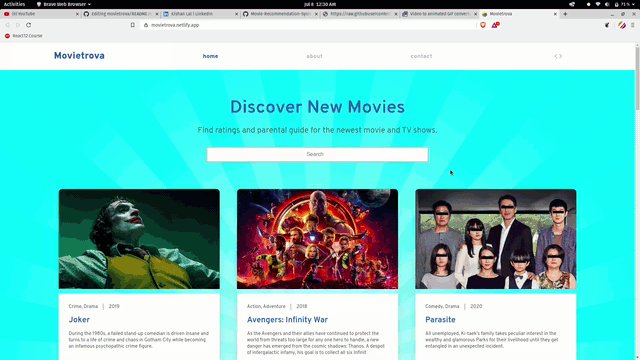

# Movietrova

Movietrova is a Prograssive Web Application that shows ratings and parental guide for the newest movies and TV shows.

Check out the live demo: https://movietrova.netlify.app/

Prograssive App Store link: https://progressiveapp.store/pwa/Movietrova

This is a React based SPA (single-page application). The details of the movies(title, genre, runtime, rating, poster, etc) are fetched using an API by TMDB, https://www.themoviedb.org/documentation/api, and using the IMDB id of the movie in the API. 

## How to get the API key?

Create an account in https://www.themoviedb.org/, click on the `API` link from the left hand sidebar in your account settings and fill all the details to apply for API key. You will see the API key in your `API` sidebar once your request is approved.

## How to run the project?

1. Clone this repository in your local system.
2. Open the command prompt from your project directory and run the command `npm install && npm start`.
5. Go to your browser and type `http://127.0.0.1:3000/` in the address bar.
6. Hurray! That's it.

